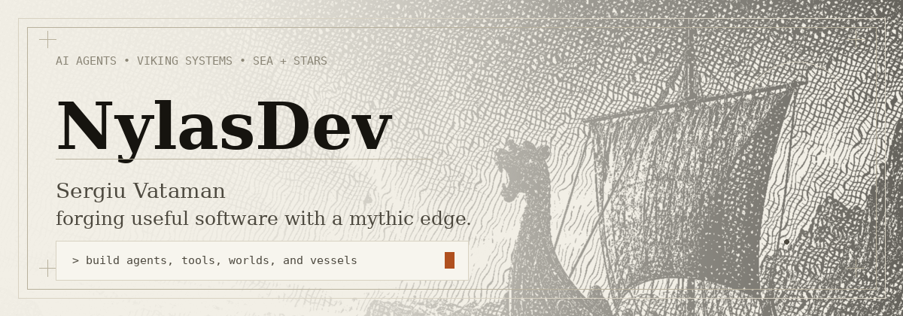

<p align="center">
  
</p>

<p align="center">
  <a href="https://www.linkedin.com/in/sergiu-vataman-b18259162"></a>
  <a href="https://github.com/NylasDev"></a>
  
</p>

## `CURRENT COURSE • AI ENGINEERING`

I'm **Sergiu Vataman** — a web developer evolving into an AI-engineering, agent-building, mythic-interface gremlin. I like software that feels useful, sharp, and a little legendary: terminal tools, Hermes-powered workflows, design systems with teeth, and automations that save humans from boring nonsense.

My compass points toward **AI agents**, **full-stack systems**, **TTRPG tooling**, **space exploration / SpaceX**, and anything that mixes practical engineering with a good story.

## `QUEST LOG • WHAT I'M BUILDING`

| Project | Signal |
| --- | --- |
| [**The Viking Company**](https://github.com/NylasDev/the-viking-company) | AI-engineer portfolio in a Hermes-style engraved parchment design system. |
| [**Hermes Mythic Design**](https://github.com/NylasDev/hermes-mythic-design) | Design tokens + engraving tool for the Renaissance-print-shop-meets-terminal aesthetic. |
| [**Nylas Dungeon Master Skills**](https://github.com/NylasDev/nylas-dungeon-master-skills) | Public Hermes/agent skills for campaigns, NPCs, lore, encounters, and tabletop craft. |
| **Agentic Terminal experiments** | Private lab work around agentic workflows in the terminal — where the useful chaos lives. |
| **RAG / pgvector work** | Private experiments with chunking, retrieval, embeddings, and the sacred art of making context less cursed. |
| [**Foundry VTT modules**](https://github.com/NylasDev/narrative-health-states-by-nylasdev) | Game-table tooling inspired by classic CRPGs and narrative-first design. |

## `TOOLBELT • LANGUAGES AND SYSTEMS`

<p align="center">
  
</p>

```txt
Primary orbit:   TypeScript · React · Next.js · Node.js · Python
Useful scars:    PHP · WordPress · PostgreSQL · Docker · GitHub workflows
Design taste:    parchment, ink, hairline rules, terminal panels, mythic engravings
Current pull:    AI agents, RAG, Hermes skills, automation, TTRPG tooling
```

## `OFFLINE LORE • WHY THE CODE IS LIKE THIS`

- ⛵ **Sailing:** ICC Skipper + GMDSS LRC — navigation brain permanently installed.
- 🤿 **Diving:** PADI Open Water, with the Advanced cert still calling from the deep.
- 🐉 **TTRPGs:** Dungeons & Dragons, worldbuilding, DM craft, Foundry VTT, and crunchy narrative tools.
- 🪐 **Space:** SpaceX, reusable rockets, deep-space exploration, and the old human habit of looking up and saying “what if?”
- ⚔️ **Mythic fuel:** Vikings, EXODUS, chess, strange machines, and assistants that should probably have names and opinions.

## `OPERATING PRINCIPLE`

> Build the thing. Test the thing. Make it useful. Then make it feel like it belongs in a saga.

<p align="center">
  
  
</p>
